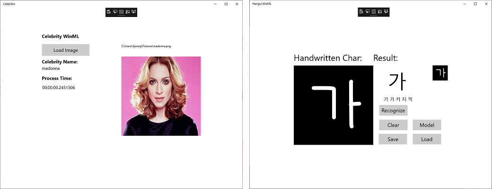

# README

Sample apps for [Windows ML](https://docs.microsoft.com/en-us/windows/ai/)

## Prerequisite (before Wndows 10 RS5)

- Install the latest Windows 10 preview (17728 or higher)
- Install the latest Windows 10 SDK preview (17723 or higher)
- Install the latest Visual Studio 2017 (15.8.1)

Note that you can get the lastest Windows 10 and SDK preview from [Windows Insider](https://insider.windows.com).

## CelebWinml

Celebrity face recognition app using exported onnx model from Customvision.ai

>> There is an export bug in [Customvision.ai](https://customvision.ai/), you need first export to `coreml` then covert to `coreml` to `onnx` using `winmltool` or [Visual Studio AI Tools](https://marketplace.visualstudio.com/items?itemName=ms-toolsai.vstoolsai-vs2017) .

## HangulWinml

Hangul character recognition app using tensorflow model. 

Original tensorflow model can be found in [tensorflow-hangul-recognition](https://github.com/IBM/tensorflow-hangul-recognition/).

Note that the model in this app was trained 10,000 steps with only 4 fonts. The overall recognition performance is not good.
You can futher improve the model by increased the number of font types and training steps.

## How to run

- Open VS solution and select a project
- Target latest SDK.
- Build and run as "x64" platform.

>> App may not run properly on Azure VM (Windows 10 preview)

## Reference

- [Windows ML](https://docs.microsoft.com/en-us/windows/ai/)
- [Windows ML Sample](https://github.com/Microsoft/Windows-Machine-Learning)